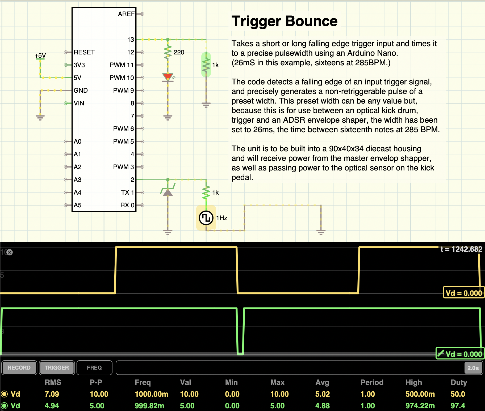

## ARDUINO TRIGGER BOUNCE
©2023 Crunchysteve<br />
filthynoisesmusic@gmail.com
    
A Eurorack trigger pulse width limiter, based on an Arduino nano. (Will work with most Arduino and related MCUs, as it's pure C) It takes a falling-edge trigger input and repeats (bounces) a finite width, falling edge pulse to the output, regardless of the width of the input pulse. Now adapted to PlatformIO, such that, if you wish to use it with ArduinoIDE, you will need to change ```src/triggerBounce.cpp``` to ```triggerBounce/triggerBounce.ino``` after downloading/cloning *and* you may need to remove the ```#include "Arduino.h"``` line from the beginning of the ```.ino``` file.

It now also relies on my edge detection library, [Edgie.D](https://github.com/crunchysteve/EdgieD), rather than local code. This library now also gives you two, predefined macros, ```Rising``` and ```Falling```, their values equal ```true``` and ```false```, respectively, but make for more readable code. From main.cpp...
```C++
    if(digitalRead(IN_SWITCH)){inEdge = Falling;} else {inEdge = Rising;}
```
...to use a switch to choose detection of a rising or falling edge.

The main code file is a generalised, non retriggerable pulsewidth constrainer that allows for optional polarity switches to set a ```Rising``` or ```Falling``` edge input as well as ```Rising``` or ```Falling``` edge output, as well as using analog input A0 to read a pot and map period to between 20mS and 800mS. You can change the mapping vales to longer or shorter amounts, if needed.

All three versions run on a basic circuit like below, but the generalised one will default to rising edge input and output, as well as 26mS, if no switches and no pot are added to the appropriate pins.


Above is a basic circuit diagram for TriggerBounce projects. Add switches to pins D4 (input polarity) and D7 (output polarity), wired to be open to select rising edge and closed (grounded) to select falling edge, then add a 50kΩ potentiometer with low to ground, high to 5V and wiper to A0 to set the pulsewidth period. Or, just build it without, and preset your preferred values in the declarations and variable initialisations. As you can see from the waveforms, when the yellow trace (input) falls (falling edge), this triggers a shorter descending pulse (green) on the output. This pulse doesn't retrigger until another falling edge on the input. The risingTriggerBounce.ino project would show positive going pulses on the traces.

TriggerBounce uses the Chrono library, by Sofian Audry and Thomas Ouellet Fredericks. Find it at [https://github.com/SofaPirate/Chrono](https://github.com/SofaPirate/Chrono) or in the Arduino Library manager, load it into ArduinoIDE with the Library Manager or load it in VSCode/PlatformIO via your project's platformio.ini file. As mentioned above, it also now uses my EdgieD library, which can be loaded the same way as Chrono.

My vscode code completion assistant, Ollama, running codellama:7b-instruct, from this prompt...
```cli
    ollama run llama2 "Summarize this file: $(cat /Users/steve/GitHub/TriggerBounce/TriggerBounce/src/main.cpp)
```</br>

renders...
```cli
    ...Arduino code for creating a pulse generator that can produce a fixed width pulse triggered by a falling or rising edge of an input signal. The pulse width is set using a variable called `period`.

    The code includes the following components:

    1. Input pin (IN_SWITCH) for detecting the trigger edge, which can be set as either a rising or falling edge.
    2. Output pin (OUTPUT_PIN) for controlling the LED state.

    3. A pulse timer (pulsewidth) that is triggered when an edge is detected and the pulse width is set by the 'period' variable.

    4. A debounce delay (DEBOUNCE_DLY) to reduce multiple triggerings of the pulse timer due to noise or other external factors.

    5. A map function (MAP_MIN, MAP_MAX) to map the potentiometer value to a useful range for setting the `period` variable.

    The code first initializes the input and output pins, sets the analog read time to 6.5uS, and defines some constants and variables. It then enters a loop where it reads the input pin, detects edges, and triggers the pulse timer if an edge is detected and the 'period' variable has been set. The pulse width is determined by the 'period' variable, and the code checks for changes in the potentiometer value and updates the 'period' variable accordingly.

    Overall, this code seems to be designed to create a simple pulse generator that can be controlled by an external input signal and can produce a fixed width pulse with a set period.```
```
<br />

***BINGO!*** What it says on the box.
<hr />

## News 20240112
So, since first uploading (20240109), I've included my own edge detection/state change library, EdgieD, which immediately uncovered more bugs, several lengthy code reviews (my eyes hurt) and several incremental "fixes" (that fixed nothing) so, what's here now builds and will be hardware tested soon. That is all. I'm a workbench tinkerer, not a pro. I claim to "code a little", I'd never claim to be a hacker, more of a hack, really.

## News 20240109
Great news everybody! The code works! Below is a screenshot of my logic analyser traces for input (top trace), a 20% duty cycle square wave and default falling edge trigger input, while the output (bottom trace) shows a width constrained, falling edge output that isn't retriggered until the input has gone high, then fallen again. Perfect!


Next will come some basic electronic circuit diagrams that are needed for the crude prototype of my "top secret guitar pedal," then, a more refined circuit and fritzing project for hardware version 1 as a Eurorack module. Don't hold me to deadlines, as I'm reorganising a few projects at the moment, as well as doing quite a bit of self-paced learning and still need time for my peoples IRL. I don't do this for a living, although I wouldn't mind that too much, so long as it stayed niche... and wholely, solely owned.

<hr />

*Further explanation and operation details soon, maybe a wiki. In the meantime, the code is fully (possibly overly) commented.*
